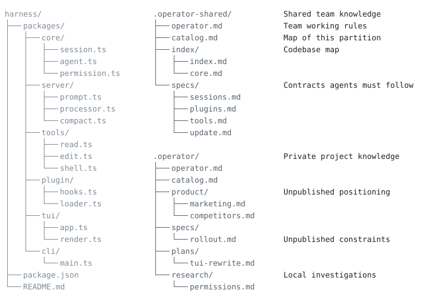

# Operator Memory

#### Operator Memory: Durable context for agent-driven development.

Operator Memory turns agent work into lasting project knowledge through continuous documentation.

<p align="center">
  
</p>

## Why Operator Memory

Agents excel in a single session. Multi-session work breaks down for two reasons:

- Context resets every conversation. Prior exploration, architecture, constraints, decisions, and conventions are often lost forever.
- Agents are strong at execution and weak at documentation. Specs, design choices, decisions, standards, and lessons rarely survive as durable project knowledge.

### Memory plugins solve the wrong problem

Standard memory plugins try to fix this by capturing fragments from transcripts, tool calls, or background observers and replaying selected snippets—or they try to drag a single session along forever through context compression without ever recording durable organizational facts. Both treat forgetting as the core problem. They fall short:

- "Memory" is in the form of disparate snippets of text: incomplete, lacking context, often irrelevant.
- Recording and retrieval is inconsistent and opaque. Users cannot see what changed, why it changed, or correct a canonical source.
- RAG does not provide organizational knowledge. RAG-based memory stores thousands of snippet chunks and returns a lossy, irrelevant top-k slice on retrieval.
- Context compression is not durable organizational knowledge. Rewriting a conversation preserves a session window; it does not leave specs, standards, and decisions as maintained project truth.
- You end up paying premium prices for complex garbage — dreamers, curators, analysts, maintenance workers — token furnaces that burn through your quota without fixing the architecture.

### Operator fixes it at the source

Operator Memory fixes the problem at the source: agents write lasting project knowledge as ordinary Markdown they maintain during normal work. Continuous documentation is the practice; durable memory is what that practice produces. Those files are yours to inspect and direct: read, create, consolidate, split, correct, or remove. No embeddings, vector database, or automatic semantic retrieval.

Knowledge is separated by ownership:

- `.operator/` — private project knowledge (Helper adds this path to the global Git ignore)
- `.operator-shared/` — project knowledge intentionally published with the repository
- `~/.operator/user/` — private instructions used across projects

Each new session orients through explicit structure, not similarity search:

1. A deterministic preamble loads standing instructions, catalog bodies, and the main project index.
2. The catalogs map Brain documents; Project indexes map the codebase. Agents open deeper files only when their routing guidance matches the task.
3. As project truth changes, agents create/update the canonical Markdown source instead of accumulating competing snippets.

For the full partition, catalog, index, and loading model, see [Architecture](docs/architecture.md).

## Install Operator Helper

Operator Helper requires Node.js 20 or newer. It manages setup, status, validation, and harness adapter installation.

Install the Helper with npm:

```sh
npm install --global @aerovato/operator-helper
```

Or Bun:

```sh
bun add --global --minimum-release-age 0 @aerovato/operator-helper@latest
```

OpenCode is the currently available harness adapter. Install the plugin:

```sh
operator-helper install opencode
```

Restart OpenCode after installing or repairing the plugin.

## Setup Operator

Operator setup happens through an interactive conversation with your agent.

### User Setup

If this is your first time using Operator, open a new conversation and run `/operator:user-init` to configure your user-global instructions.

### Project Setup

For existing projects:

1. Start a new conversation and run `/operator:project-init`. The agent will scaffold Operator infrastructure with you.
2. Start a new conversation and run `/operator:index`. The agent will begin to map the repository into a Project Index and focused subindexes so future agents can navigate the codebase efficiently.
3. Start a new conversation and begin normal development.
4. As you're starting cold, tell the agent which features, modules, or systems need their first specs. Creating those documents is a judgment call; once they exist, later sessions will maintain them.

For new projects:

1. Start a new conversation and run `/operator:project-init`. The agent will scaffold Operator infrastructure with you.
2. Start a new conversation and begin normal development.

## Everyday Workflow

Operator gives the agent a durable workspace. The agent records lasting knowledge during ordinary work and updates existing Brain documents when project truth changes. You stay the architect of the larger shape of that workspace.

1. Give the agent normal development work. The agent uses the preamble for core orientation, consults the Project Index to navigate code, and reads applicable Brain documents through the catalogs.
2. As it works, the agent identifies knowledge worth preserving—specifications, decisions, plans, standards, research, architectural rationale, and hard-won lessons—and writes it down while the reasoning is still fresh.
3. When project truth changes, the agent updates the canonical source instead of adding a competing memory.
4. The agent maintains surrounding structure: catalogs when Brain content changes, and Project Indexes when the codebase map grows or changes.
5. Future sessions load that orientation and continue from the knowledge previous agents left behind.

Agents prefer to maintain what already exists. They are less likely to create a new document, consolidate two documents, split a document that has grown too large, or trim one that has gone stale. Those are judgment calls about the project's long-term needs, and you know those better than the agent.

Steer large structural decisions. No need to micromanage ordinary updates.

- “Write a spec for this feature before implementing it.”
- “Record this research so we do not repeat the investigation.”
- “These two documents overlap. Consolidate them.”
- “This document is too large. Split it.”
- “Promote this spec to Shared so the team receives it.”

This direction matters most after adding Operator to an existing project. The initial Brain may contain only instructions, catalogs, and indexes; ask the agent to write first specs for specific modules, packages, or systems. Once those documents exist, later sessions maintain them as part of normal work.

Brain Markdown is the source of truth. Catalogs map Brain documents; Project Indexes map code.

## Commands

Run each Operator command in a new conversation so the agent can focus on setup, indexing, or repair with a clean working context.

#### `/operator:user-init`

Initializes or revises private user-global instructions in the current conversation.

#### `/operator:project-init`

Initializes or revises project setup without overwriting existing content. It configures Private and guides optional Shared activation.

#### `/operator:index`

Builds or refreshes the Project Index so future agents can navigate repository structure and applicable subsystem context. Run it after initial setup, substantial repository restructuring, or stale index discovery.

#### `/operator:repair`

Diagnoses and repairs missing, malformed, or unloadable Operator context in the current conversation.

## Roadmap

**Operator Memory is under active development.** More features are on the way, including support for other harnesses.

#### Brain Improvements

- **Observation Engine** — Learn durable user observations over time, kept separate from explicit User Instructions.
- **Reliable Brain Updates** — Keep specs and other Brain documents current during long conversations, instead of relying only on the agent to remember.

#### Context Management

- **Cache-Aware Context Management** — Automatically refresh preamble and apply tool call pruning when cache expires.
- **Lossless Context Compression** — Losslessly extend context via lossless context compression.

#### Additional Harnesses

- **Pi** — Next adapter
- **Claude Code** — Pending research
- **Codex** — Pending research

## Learn More

- [Workflow](docs/workflow.md) - how to direct continuous documentation and maintain a useful Brain.
- [Architecture](docs/architecture.md) - how partitions, catalogs, indexes, and deterministic context loading work.
- [Troubleshooting](docs/troubleshooting.md) - installation, validation, repair, and update recovery.

## License

BSD 3-Clause. See [`LICENSE`](LICENSE).
