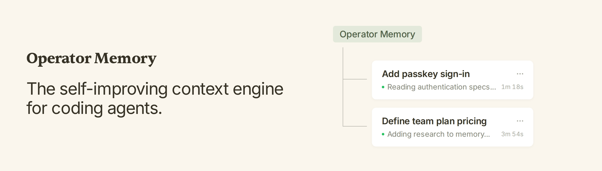
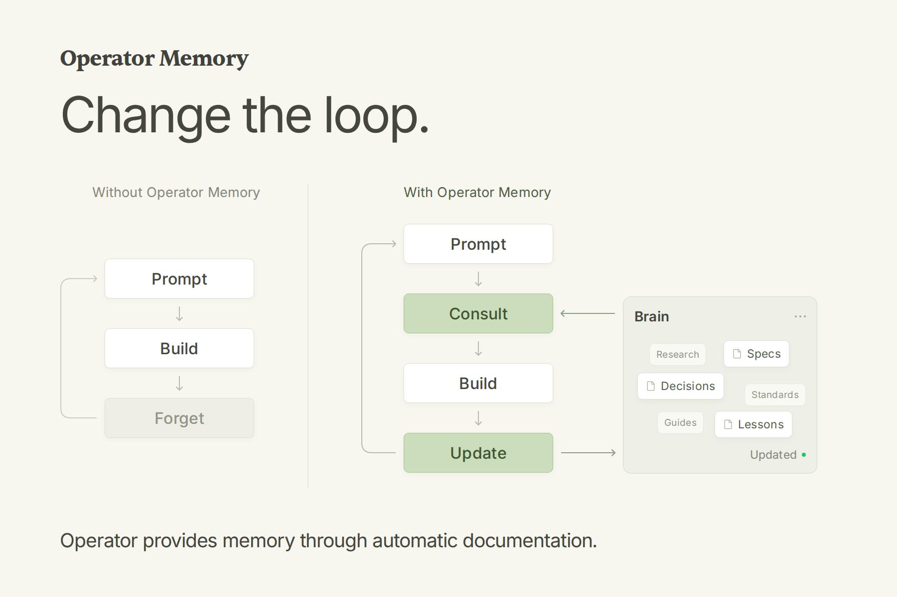

<p>
  
</p>

<p align="center">
  <a href="README.md">English</a> | <a href="README.zh-CN.md">简体中文</a>
</p>

---

### Operator Memory：面向编码智能体的自我改进上下文引擎。

Operator Memory 给你的智能体一个大脑，用于记录他们的全部工作。智能体在工作时，会自动在这个大脑中记录 —— 规格、决策、规范、研究、经验教训。每个新会话都带着上一个会话学到的一切开始。

#### 功能特性

- **完整的上下文引擎** —— 在单一集成系统中提供文档、记忆、索引和技能。
- **自动文档** —— 规格、决策、研究等由智能体在日常工作中自动记录。
- **透明的记忆** —— 记忆以 Markdown 文档形式存储，你可以阅读、更新和删除。
- **可共享的知识** —— 用 Git 跟踪文档，与团队分享知识。
- **零基础设施** —— 无后台智能体、无 embeddings、无向量数据库、无模型配置。

### 安装

Operator 通过 Operator Helper 管理。使用 npm 安装 Helper：

```sh
npm install --global @aerovato/operator-helper
```

或使用 Bun：

```sh
bun add --global --minimum-release-age 0 @aerovato/operator-helper@latest
```

然后为你的 harness 安装 Operator 适配器。点击各链接查看对应 harness 的详细信息。

| Harness | 状态 | 安装 |
| --- | --- | --- |
| [Claude Code](docs/harnesses/claude-code.md) | 🟢 完全支持 | `operator-helper install claude-code` |
| [Codex](docs/harnesses/codex.md) | 🟢 完全支持 | `operator-helper install codex` |
| [OpenCode V2](docs/harnesses/opencode-v2.md) | 🟢 完全支持 | `operator-helper install opencode-v2` |
| [OpenCode V1](docs/harnesses/opencode.md) | 🟡 支持（旧版） | `operator-helper install opencode` |
| [Pi](docs/harnesses/pi.md) | 🟢 完全支持 | `operator-helper install pi` |
| [DeepSeek Harness](docs/harnesses/deepseek.md) | 🟢 完全支持 | `operator-helper install deepseek` |

设置就是与智能体的一场对话。在新的会话中逐个运行以下命令。

1. 仅首次：`/operator:user-init` —— 设置你的全局用户分区。
2. 在每个新项目中：`/operator:project-init` —— 搭建 Operator、迁移已有文档并为仓库建立索引。
3. 开启新会话，正常工作即可。

在现有项目上冷启动时，一开始大脑会比较空缺；让智能体为你负责的模块编写第一批规格。这些文档建立后，后续会话会将其作为日常工作的一部分自动维护。

<p align="center"><big><strong>初次使用 Operator？请先阅读<a href="docs/getting-started.zh-CN.md">入门指南</a>。</strong></big></p>

### Operator 的工作原理

智能体在单次会话中表现出色，但会话一结束就会忘记一切。后续会话只能浪费 token 重新收集不完整的上下文：重新探索代码库、重新理解架构、重新讲授决策和纠正。

Operator 给智能体一个持久的 Markdown 工作区，保存在三个位置：

- `.operator/` —— 私有项目知识，保留在你的机器上
- `.operator-shared/` —— 随仓库一起发布的项目知识
- `~/.operator/user/` —— 你的个人规则和知识，跨项目使用

每个会话都运行同一个循环：

1. **查阅（Consult）** —— 智能体从大脑出发：指令、代码库索引、规格、指南。
2. **构建（Build）** —— 智能体基于这些知识进行正常的开发工作。
3. **更新（Update）** —— 智能体记录发生的变化：新的规格、决策、规范、经验教训。

当项目事实发生变化时，智能体会更新规范文件，而不是添加一条 RAG 数据库记录。更多细节见[架构文档](docs/architecture.md)（英文）。

<p>
  
</p>

### 日常工作流

1. 给智能体正常的开发任务。
2. 智能体自动查阅已有知识：索引用于导航代码，规格用于模块契约，指南用于第三方集成细节。
3. 智能体自动更新已有知识：当项目事实变化时，相关文档会被自动更新。
4. 下一个会话从更新后的知识继续。

有时智能体对创建、合并或拆分文档会犹豫不决。此时，引导智能体做出更大的架构决策：

- "在实现这个功能之前，先为它写一份规格。"
- "把这次研究记录下来，避免重复调查。"
- "这两份文档有重叠。把它们合并。"
- "这份文档太大了。拆分它。"
- "把这份规格提升到 Shared，让团队也能收到。"

### 路线图

**Operator Memory 正在积极开发中。** 更多功能正在路上。

#### 大脑改进

- **观察引擎（Observation Engine）** —— 随时间学习持久的用户观察，与显式用户指令分开保存。
- **可靠的大脑更新** —— 在长对话中保持规格等大脑文档的最新状态，而不是仅依赖智能体自己记住。

#### 上下文管理

- **缓存感知的上下文管理** —— 缓存过期时自动刷新 preamble 并执行工具调用剪枝。
- **无损上下文压缩** —— 通过无损上下文压缩无损扩展上下文。

### 对比其他记忆插件

片段捕获、RAG 检索和上下文压缩以同样的方式失败：[阅读对比文章](docs/comparison.md)（英文）。

### 了解更多

- [入门指南](docs/getting-started.zh-CN.md)- Operator 的工作机制、安装、日常使用、引导与审查。含命令参考。
- [架构](docs/architecture.md)（英文）- 分区、目录、索引和确定性上下文加载的工作原理。
- [Harness 文档](docs/harnesses/)（英文）- 各 harness 的安装、验证、命令、更新和故障排除。
- [故障排除](docs/troubleshooting.md)（英文）- 验证、修复和更新恢复。

### 许可证

BSD 3-Clause。见 [`LICENSE`](LICENSE)。
