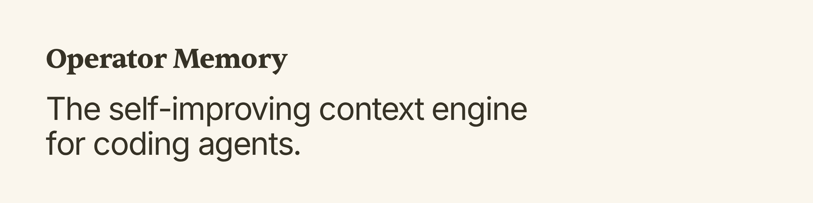

# Getting Started With Operator

Operator Memory turns agent work into lasting project knowledge. You assign normal development tasks; agents record, update, and shape durable documents as they work. There is no memory administration for you to perform. Your job is to direct the agent's structural decisions; the agent owns day-to-day recording.

### How Operator Works

That knowledge lives in the Brain, a human-readable set of Markdown files split into three partitions:

- `~/.operator/user/` — User/global partition. Project-agnostic memory: your communication preferences, engineering standards, and reusable prompts and skills.
- `.operator/` — Project private partition. Local project knowledge such as work in progress, private plans, and internal research.
- `.operator-shared/` — Project shared partition. Knowledge published with the repository for collaborators and future clones.

Inside each partition, four kinds of content cooperate:

- Operator Instructions (`operator.md`) carry standing rules for how the agent works in that scope — `AGENTS.md`, but more powerful. When instructions conflict, the hierarchy is: Private > User > Shared.
- Partition Catalogs (`catalog.md`) map that partition's knowledge: what each document covers and when to open it.
- Project Indexes (`index/`) map the codebase itself so the agent can navigate source without rediscovering the layout. Catalogs map Brain knowledge; indexes map code.
- Freeform documents are everything else — specifications, plans, research, guides — read on demand through catalog guidance.

At the start of every conversation, Operator loads a short preamble: Operator Guidance (fixed framework rules), Operator Instructions merged by authority, Partition Catalogs, and the Main Project Index. Everything deeper stays on disk, read only when the task calls for it.

**The brain is NOT a summary of the code.** The brain is designed to store context, contracts, requirements, conventions, decisions, and other meta-information that the code cannot own.

For the full architecture, see [Architecture](architecture.md).

### Get Started

1. Run `/operator:user-init` in a new conversation to establish user-global working instructions. This is a one-time step. Rerun anytime to update user instructions.
2. Run `/operator:project-init` in a new conversation to initialize the private partition, configure sharing rules, and index the repository. Project setup runs once per project.
3. Start a new conversation and give the agent ordinary development work.

If the brain is ever out of sync, for example from significant upstream changes, ask the agent to pull and update the brain. The agent will automatically update the brain and indexes.

### Using Operator

Give the agent normal development work: features, fixes, refactors. Operator orients each session automatically; the agent consults brain material, records lasting knowledge, and updates existing documents when the truth those documents own has changed.

If using on an existing project, expect a sparse Brain at first. Due to inertia, agents may hesitate to write their first documents; you should ask directly to write the first specifications or research for particular modules or systems as you work on them. Once documents exist, later sessions become more comfortable maintaining and adding documents as part of ordinary work.

---

#### Example:

You initialize Operator on an existing project and start work on a module you know well. The brain has no documents for it yet.

Ask the agent to analyze the module: how it's structured, how it fits into the rest of the project, what it actually does. Provide links to online documentation for background information. Encourage questions, make clarifications, and have the agent report back with a brief summary.

Assess the agent's knowledge. Provide the agent with additional meta-information that it cannot infer: why the module exists, what problem it solves, requirements, constraints, etc. Afterwards, have the agent write a specification or another context document.

Future agents will open that document before touching the module, instantly gaining a complete view into that module's purpose, as well as deeper motivations that code or comments alone cannot provide.

---

### Steer The Agent

Agents will read and update documents that already exist. However, current agents prefer the status quo; at times, they may hesitate to:

- Create new types of documents
- Consolidate two related documents into one
- Split a large document into two

Certain larger architectural moves will need your judgements of the project's long term needs. In these cases, you must steer the agent:

- "Draft a plan for this change and record it in the brain."
- "Record as a reusable guide so we do not repeat the investigation."
- "Clone this source tree and create a subindex to use for future reference."
- "These two documents overlap. Consolidate them."
- "This document is too large. Split it."
- "Promote this spec to the shared partition so the team receives it."

---

#### Example:

You work regularly with a third-party library that your agent is not familiar with. Your agent often spends lots of time searching the web for resources.

With Operator, that changes.

Clone the library source tree into a .gitignored `references/` directory. Ask the agent to create a subindex for that tree. Ask the agent to create reusable Operator guides for any APIs or systems you commonly interact with.

Future sessions will use the guide instead of searching the web. If uncertain, agents use the subindex to peer into source code as source of truth.

---

### The Brain

The brain is ordinary Markdown on disk. It is transparent, flexible, and highly scalable. Some examples of what you can do with the brain:

- You may ask agents to create a guide for writing in your specific style in `~/.operator/user/writing-style.md`
- You may ask agents to capture a PR review workflow as a reusable global skill in the user partition `~/.operator/user/`.
- You may ask agents to keep a dossier on a competitor's architecture in the private partition, updated each time you ask it to `git pull` the reference code.
- You may ask agents to create checklists for implementing new features so it never forgets to update the `changelog.md` again.
- You may ask agents to enforce a repo-wide standard the intern keeps breaking by adding shared conventions to `.operator-shared/operator.md`

Customize your brain and your agent's behavior however you want. With Operator, the world is yours.

### Appendix: Commands

Tip: Run each Operator command in a new conversation so the agent can focus on setup or repair with a clean working context.

- `/operator:user-init` — Initializes or revises private user-global memory (instructions and freeform) in the current conversation.
- `/operator:project-init` — Initializes or revises project setup without overwriting existing content. It configures Private, guides optional Shared activation, and indexes the repository.
- `/operator:index` — Builds or refreshes the Project Index so future agents can navigate repository structure and applicable subsystem context.
- `/operator:repair` — Diagnoses and repairs missing, malformed, or unloadable Operator context in the current conversation. See [Troubleshooting](troubleshooting.md).
